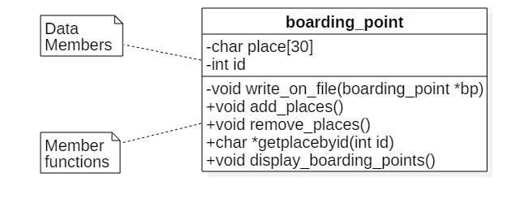
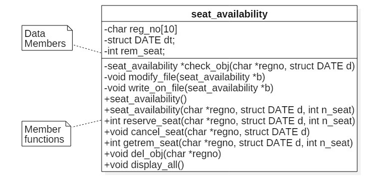
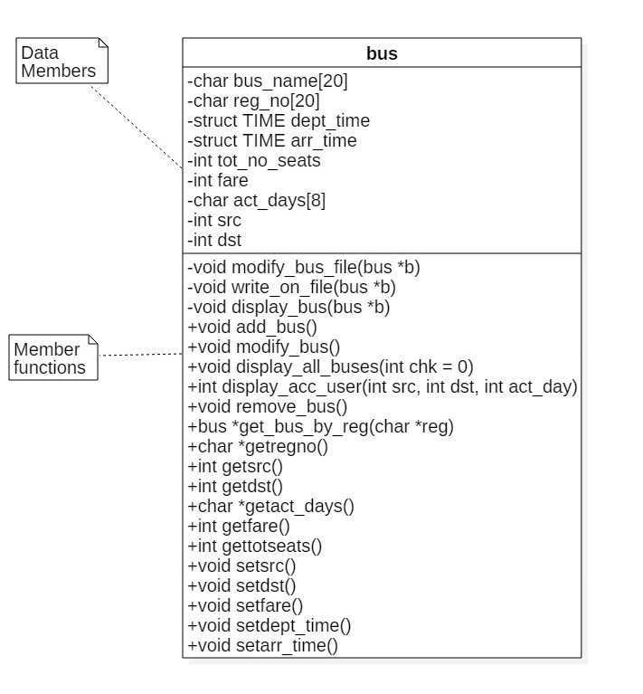
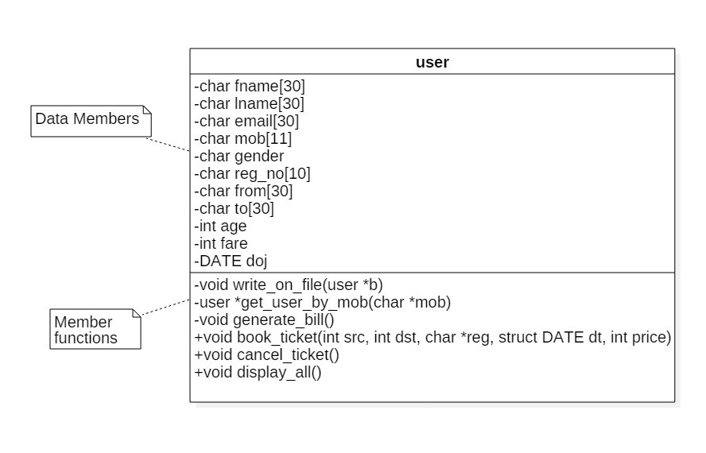
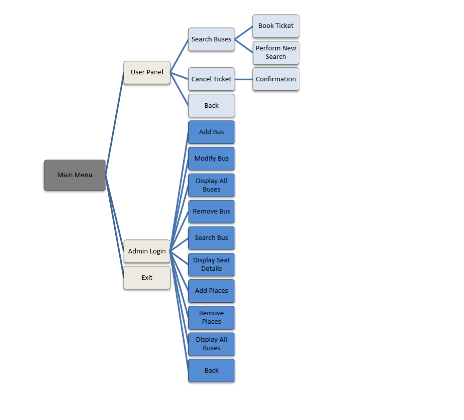

# Bus Reservation System

A simple terminal based local bus reservation written in C++ as a project.

# Introduction

The project is a simulation of booking of seats in a bus. This program basically provides a platform for booking, and cancellation of seats. Keeping records on computer is better as it provides greater flexibility and convenience to user and agencies.     
Here, we are introducing a platform, where user can book the bus ticket, with the help of a computer system. And also it provides the bus agency a platform to maintain the bus records, all the bookings and the user records.

# Problem statement

Manual procedure of booking a bus takes time as the user has to approach the bus controller. Booking using a computer system is very much easy and efficient as it can keep all kinds of records in one place. Any manipulation in any record leads to changing the records in all the registers. Implementing it in program prevents such a tedious task.

# Class Diagram

# Implementation

The program comprises of 4 classes.

1) Boarding _point:

This class is used to add the places, for the user to choose the source and destination. The places added can also be deleted. The data related to this class is stored in the file called “places.txt”. Only the admin has the authority to add and delete the places.

Functions used:

* void write_on_file(boarding_point *bp)
This function is used to write the data related to boarding point, which the admin wants to add, into a file.
* void add_places()
This is used to add new places, for the bus to commute between. This function is called in the main function, where the admin can add new places.
* void remove_places()
This function is used to delete the places from the existing list of places. It is done by entering the place ID. This function also makes modifications in the file directly. This function is called through admin section. 
* char *getplacebyid(int id)
When a particular place ID is entered, this function finds out and returns the corresponding place from the file.
* void display_boarding_points()
This function displays the boarding places for the user and the admin, by reading into the file.

2) Seat_availibilty:

This class handles everything related to seat allocation. This class is implemented to keep a track of seat available seats in a particular bus for a particular date. If there is no detail about a particular bus and date, that means, that there is no reservation for that date and for that bus. The data related to this class is stored in a file called “seatfile.dat”.
Functions used:

* seat_availability *check_obj(char *regno, struct DATE d)
Before reserving a seat or cancelling a seat for a bus and given date, this function read the file and gets the seat_available object for the matching date, registration number. It then returns the pointer to the object. 

* void modify_file(seat_availability *b)
This function is used to alter the seat details of a bus for a particular date. This function is called whenever the seat is booked or cancelled. Accordingly it deletes the old object from file and writes down the new one.

* int reserve_seat(char *regno, struct DATE d, int n_seat)
This function helps the user in reserving the seat and also notifies if the seats are full for the particular date.

* void cancel_seat(char *regno, struct DATE d)
This function is used to increase the remaining number of available seats, when the user cancels the ticket. The function, modify_file() is called in order to make the changes in the file.

* int getrem_seat(char *regno, struct DATE d, int n_seat)
This function returns the remaining number of seats for a particular bus, for a particular date. This function is called in the main(), when the admin wishes to see the bus details.

* void del_obj(char *regno)
Whenever the bus is modified or removed then this is called in order to clear all the existing seat details of that bus.

* void display_all()
This function is used to display the remaining seats, for a particular date.
 
3) bus:

This class is implemented to keep track of bus data in the file. Only the admin can use this class. It provides the admin to add a bus, remove a bus, display all the buses and display all the bookings. All the data are stored in “bus_data.dat” file.
Functions used:

* void modify_bus_file(bus *b)
This function is used to modify the bus_file, whenever the admin wants to modify the bus details.
* void add_bus()
This function is used to add a bus, which commutes between two places for particular days. All the details of the bus are taken as input, stored in the object of bus, and then written to file.
* void modify_bus()
This function allows the admin to modify the bus details including the fare, timings and the days for which it is available.
* void display_bus(bus *b)
This function is used to display the bus details like the fare, timings, remaining number of seats and the days for which it operates.
* void remove_bus()
This function allows the admin to remove the bus from the list. It requires the bus registration as input. And it also modifies the file accordingly.
* bus *get_bus_by_reg(char *reg)
It takes char *reg as a parameter. It goes through the bus_data file and finds out the data of that reg_no. Finally returns a pointer that stores bus data. 
* char *getregno()
This function returns the registration number.
* int getsrc()
This function returns the source id.
* int getdst()
This function returns the destination id.
* char *getact_days()
This function returns the days, for which a bus operates.
* int getfare()
This function returns the total fare for the journey.
* int gettotseats()
This function returns the total number of remaining seats in a bus.
* void setsrc()
This function is used to set the source for the journey.
* void setdst()
This function is used to get the destination.
* void setfare()
This function is used to set the fare for a particular bus, by the admin.
* void setdept_time()
This function is used to set the departure time for the bus, by the admin.
* void setarr_time()
This function is used to set the arrival time for the bus, by the admin.

4) User:

This class is associated with the user. The user books the seat and the bill is generated.
The user can cancel the ticket, by inputting the correct contact number.  It stores all the user data for billing. Data is stored in file called “userfile.dat”.
Functions used:

* user *get_user_by_mob(char *mob)
It takes char *mob as a parameter. It goes through the userfile.dat file and finds out the data of that mob. Finally returns a pointer that stores user data.
* void generate_bill()
This function generates the bill, when a user books a seat. The bill shows the name of the passenger, the email id, the contact number, the gender of the passenger, the age, the registration number of the bus, the date of journey, the source and the destination and the fare.
* void book_ticket(int src, int dst, char *reg, struct DATE dt, int price)
This function helps the user to enter the important data, when a seat is to be booked. This function then later calls the generate_bill() to display fare and other details, and also call the write_on_file to write the data into the file. 
* void cancel_ticket()
This function helps the user to cancel the ticket. The user is expected to enter the contact number, under which the seat is booked. It then makes respective changes to the file. Also calls a function cancel_seat in seat_availabilty class. 
* void display_all()
This function is called when the admin wants to see the details of all the users who have booked the ticket. 

# Class Chart

